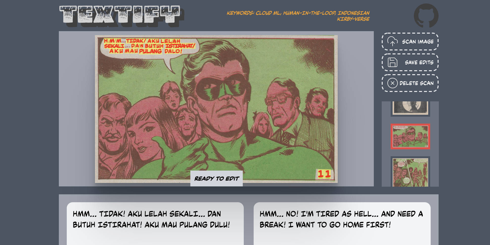

  

    
  

Textify is a rudimentary scanlation editor–a CRUD with cloud ML hooks, essentially–inspired by my recent preoccupation with international comics collecting.

  

### The Cloud ML functions

- **Storage.put** (in [components/Buttons](components/Buttons/index.js))
- **Predictions.interpret** (IDs language)
- **Predictions.identify** (IDs text)
- **Predictions.convert** (translates, in [components/Text](components/Text/index.js))

### The CRUD functions
- **Next.js api routes** (see [pages/api](pages/api/))
- **astraClient.collection** ([using route params](/pages/api/create/[collectionName]/index.js))
- **react-query hooks** ([hooks folder](hooks/) & [components/Buttons](components/Buttons/index.js); useDelete & useUpdate not used yet.)

### New Libraries I'm Trying

- **TailwindCSS** (in [global.css](styles/globals.css) & most components) 
- **react-easy-edit** (see [components/Text](components/Text/index.js))

### Medium-Length Explainers ###

- [The Multiverse Next Door (Feb 2021)](https://joeyanuff-33180.medium.com/the-multiverse-next-door-444477bdaf63): **Digging the global comics underground with cloud APIs & JavaScript**

  > This project thus has dual goals: to introduce some crazy new archaeology to comics fandom, and to scaffold a simple tool for deciphering it, narrowly designed for personal, non-commercial use.

- [AWS Lambdas: Easy, Easier, Easiest (Apr 2021)](https://joeyanuff-33180.medium.com/aws-lambdas-easy-easier-easiest-823e71c02bd9): **Step-by-step serverless function setup using Amplify, Netlify, or Vercel.**

  > Having reached the point in my app’s development where I do need a Lambda–to chat with the Apache Cassandra database where I’ll be storing my translations–it seemed worthwhile to feature-compare my walkthroughs of the three APIs.

- [6 Tricks for Simpler Cloud CV (Dec 2020)](https://joeyanuff-33180.medium.com/6-tricks-for-simpler-cloud-cv-1036b99ac791): **How AWS Amplify simplifies my workflow.**

  > My prototype app used two custom Lambda endpoints, configured using Amazon’s Gateway API: a Node.js function to save images to S3 and a Python function to call Amazon’s Textract OCR service. With Amplify, both of these are one-liners.

- [6 Tricks for Next-Level CRUDs (Dec 2020)](https://joeyanuff-33180.medium.com/6-tricks-for-next-level-cruds-9a916d9e4c87): **How to use react-query to monitor cached data.**

  > Changes on the detail page are reflected instantly–and reverted if they fail–using the Optimistic Update strategy. With React Query’s devtools drawer open, we have perfect visibility into the state of our cache.
